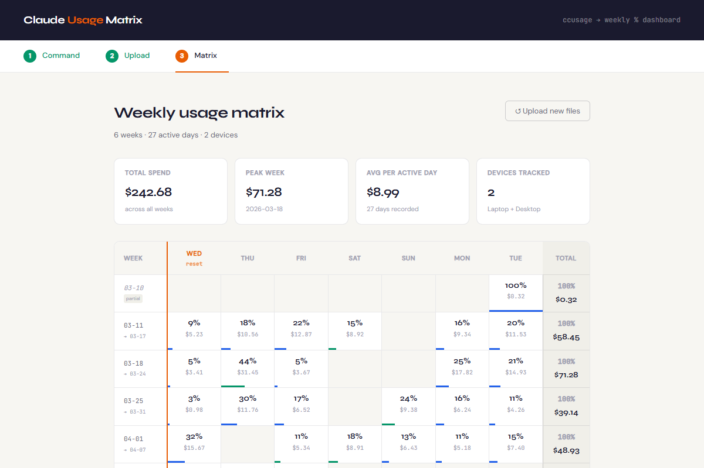

# Claude Usage Matrix

Weekly token budget dashboard — see how your Claude spend distributes across each day of the week.



## Quick start

### Option A — Fully automated (recommended)
```bash
node launcher.js
```
That's it. Runs ccusage, processes data, opens the browser automatically.

### Option B — Manual (works without Node server, upload from any machine)
1. Run on each machine you use Claude from:
   ```bash
   npx ccusage daily --json > usage_daily.json
   ```
2. Open `dashboard.html` in your browser (double-click, or `open dashboard.html`)
3. Upload the JSON file(s) and click **Build matrix**

---

## Multi-machine setup

To merge data from multiple machines (e.g. work MacBook + home Windows PC):

1. Run the export command on **each machine**
2. Copy all `usage_daily.json` files to one place — rename them so they don't overwrite each other:
   ```
   macbook_usage.json
   rog_usage.json
   ```
3. Open `dashboard.html` and upload **both files at once**

The dashboard auto-merges them, combining same-day entries and color-coding each device.

---

## Options (launcher.js)

```bash
node launcher.js                    # default: port 3131, opens browser
node launcher.js --port 4000        # custom port
node launcher.js --no-open          # skip auto-open
node launcher.js --reset-day 1      # change weekly reset (0=Sun, 1=Mon ... 6=Sat)
MACHINE_NAME="MacBook" node launcher.js  # custom device label
```

---

## What you see

- **Calendar matrix**: each row is a week (Wed→Tue by default), each column is a day
- **Percentage bars**: shows each day's share of that week's total budget
- **Color coding**: blue = machine 1, teal = machine 2, purple = both
- **Partial weeks**: first and last rows marked as partial
- **Hover tooltips**: exact date, cost, tokens, device

---

## Requirements

- Node.js 16+ (for launcher.js)
- npx (bundled with Node.js)
- Claude Code sessions in `~/.claude/projects/`
